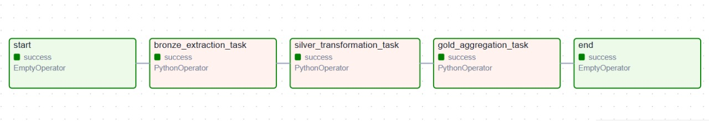

# BEES Data Engineering – Breweries Case

A data engineering solution for ingesting, transforming, and aggregating brewery data from the Open Brewery DB API into a medallion architecture (Bronze, Silver, Gold layers) on Azure Data Lake Storage.

## 📋 Table of Contents

- [Overview](#overview)
- [Architecture](#architecture)
- [Technology Stack](#technology-stack)
- [Project Structure](#project-structure)
- [Development Process](#development-process)
- [Prerequisites](#prerequisites)
- [Setup Instructions](#setup-instructions)
- [Running the Pipeline](#running-the-pipeline)
- [Accessing Results](#accessing-results-for-examiners)
- [Data Quality & Monitoring](#data-quality--monitoring)

---

## 🎯 Overview

This project implements an **end-to-end data pipeline** that:

1. **Ingests** brewery data from Open Brewery DB API (Bronze layer)
2. **Transforms** and cleanses the data using PySpark (Silver layer)
3. **Aggregates** brewery counts by type and location (Gold layer)
4. **Orchestrates** the workflow using Apache Airflow
5. **Stores** data in Azure Data Lake Storage in Parquet format

### Key Features

- ✅ Medallion architecture (Bronze → Silver → Gold)
- ✅ Partitioned data storage by `state_province`
- ✅ Daily scheduled runs with configurable backfill
- ✅ Comprehensive logging and error handling
- ✅ Data quality checks at each layer
- ✅ Containerized deployment with Docker
- ✅ PySpark for scalable transformations

---

## 🏗️ Architecture

### Medallion Architecture Layers

```
┌─────────────────┐      ┌──────────────────┐      ┌─────────────────┐
│  Bronze Layer   │─────▶│  Silver Layer    │─────▶│   Gold Layer    │
│  (Raw JSON)     │      │  (Cleaned Parquet│      │  (Aggregated)   │
│                 │      │   + Partitioned) │      │                 │
└─────────────────┘      └──────────────────┘      └─────────────────┘
      ▲                         ▲                         ▲
      │                         │                         │
  API Ingestion           PySpark Transform        PySpark Aggregate
```

**Bronze Layer**: Raw API data stored as JSON
- Source: Open Brewery DB API
- Format: JSON
- Location: `datalake/bronze/breweries_list.json`

**Silver Layer**: Cleaned and normalized data
- Transformations:
  - Type casting (latitude/longitude to float)
  - Null handling (state_province = "UNKNOWN")
  - Data validation
- Format: Parquet (partitioned by `state_province`)
- Location: `datalake/silver/breweries/state_province=<state>/`

**Gold Layer**: Aggregated business metrics
- Aggregation: Count of breweries by `brewery_type`, `city`, `state_province`, `country`
- Sorted by: `brewery_count` (descending)
- Format: Parquet
- Location: `datalake/gold/`

#### Airflow DAG Overview


---

## 🛠️ Technology Stack

| Component | Technology | Purpose |
|-----------|-----------|---------|
| **Orchestration** | Apache Airflow 2.10.3 | Workflow scheduling and monitoring |
| **Processing** | PySpark 3.5.3 | Distributed data transformation |
| **Storage** | Azure Data Lake Storage Gen2 | Cloud data lake (medallion layers) |
| **Containerization** | Docker & Docker Compose | Environment consistency |
| **Language** | Python 3.9 | Core development language |
| **Data Format** | Parquet | Columnar storage format |
| **API** | Open Brewery DB API | Data source |

---

## 📁 Project Structure

```
breweries_case/
├── dags/
│   ├── bees_breweries_case/
│   │   ├── tasks/
│   │   │   ├── bronze_ingestion_task.py      # API ingestion to Bronze
│   │   │   ├── silver_transformation_task.py  # PySpark transformation
│   │   │   └── gold_aggregation_task.py       # PySpark aggregation
│   │   ├── tools/
│   │   │   └── schema_tables.py               # PySpark schemas
│   │   └── dag_bees_breweries_case.py         # Airflow DAG definition
│   └── config/
│       ├── az_storage.py                      # Azure Storage client
│       └── logging_config.py                  # Logging configuration
├── docker/
│   └── Dockerfile                             # Custom Airflow image
├── logs/                                      # Airflow logs
├── docker-compose.yaml                        # Services orchestration
├── .env                                       # Environment variables (DO NOT COMMIT)
└── README.md                                  # This file
```

---

## 💭 Development Process

### Design Decisions

#### 1. **Medallion Architecture**
   - **Why?** Industry-standard pattern for data lakes that separates raw, cleaned, and curated data
   - **Benefits**: Clear data lineage, incremental processing, easier debugging

#### 2. **PySpark for Transformations**
   - **Why?** Scalability for large datasets, distributed processing capabilities
   - **Trade-off**: Added complexity vs. pandas (chosen for production-readiness)

#### 3. **Local Temp + Azure Upload Pattern**
   - **Challenge**: Hadoop-Azure connector classpath conflicts (`NoClassDefFoundError`)
   - **Solution**: Write Parquet locally first, then upload via Azure SDK
   - **Benefits**: Avoids JVM dependency issues, more reliable

#### 4. **Partitioning by State/Province**
   - **Why?** Enables efficient query pruning for location-based analytics
   - **Implementation**: PySpark `partitionBy()` with null handling ("UNKNOWN")

#### 5. **Daily Schedule with Backfill**
   - **Why?** Production data pipelines need historical data reprocessing
   - **Configuration**: `start_date`, `catchup=True`, `max_active_runs=1`

### Key Challenges & Solutions

| Challenge | Solution |
|-----------|----------|
| **Hadoop-Azure JAR conflicts** | Switched to local temp + Azure SDK upload |
| **State_province nulls breaking partitioning** | Added `.fillna({"state_province": "UNKNOWN"})` |
| **Reading partitioned Parquet from Azure** | Download to temp, read locally with Spark |
| **Docker image size** | Multi-stage build, removed unnecessary packages |

---

## 📋 Prerequisites

Before you begin, ensure you have:

- **Docker + Docker Compose** installed
- **Azure Storage Account** credentials (provided in `.env` file sent on e-mail to the examiners)

## 🚀 Setup Instructions

### Step 1: Clone the Repository

```bash
git clone <repository-url>
cd breweries_case
```

### Step 2: Configure Environment Variables

Copy the `.env` file received in the project root

### Step 3: Build the Docker Image

```bash
docker-compose build
```

This will:
- Build a custom Airflow image with PySpark and Azure dependencies
- Install required Python packages
- Download Hadoop-Azure JARs

**Expected time**: 5-10 minutes (first build)

### Step 4: Initialize Airflow Database

```bash
docker-compose up airflow-init
```

### Step 5: Start All Services

```bash
docker-compose up -d
```

This starts:
- **Airflow Webserver** (port 8080)
- **Airflow Scheduler**
- **PostgreSQL** (metadata database)

### Step 6: Verify Services

Check all containers are running:

```bash
docker-compose ps
```

Expected output:
```
NAME                    STATUS
airflow-scheduler       Up
airflow-webserver       Up
postgres                Up
```

---

## 🎮 Running the Pipeline

### Access Airflow UI

1. Open browser: http://localhost:8080
2. Login credentials:
   - **Username**: `airflow`
   - **Password**: `airflow`

### Trigger the DAG

1. Navigate to **DAGs** page
2. Find `bees_breweries_case`
3. Toggle the DAG **ON** (switch on left)
4. Click on play **▶** button

---

## 🔍 Accessing Results (For Examiners)

A **read-only SAS token** is provided on the e-mail sent to the examiners to view the processed data on Azure Environment.

### Azure Storage Explorer

1. Download [Azure Storage Explorer](https://azure.microsoft.com/features/storage-explorer/)
2. Install and open the application
3. Click **Connect** → **Blob container or directory**
4. Select **Shared access signature URL (SAS)**
5. Paste the SAS URL received via e-mail
6. Navigate to: `datalake` container.

### Data Structure

```
datalake/
├── bronze/
│   └── breweries_list.json              # Raw API response
├── silver/
│   └── breweries/
│       ├── state_province=California/   # Partitioned by state
│       │   └── part-00000.parquet
│       ├── state_province=Texas/
│       │   └── part-00000.parquet
│       └── state_province=UNKNOWN/
│           └── part-00000.parquet
└── gold/
    └── part-00000.parquet                # Aggregated metrics
```

---

## 📊 Monitoring

### Logging

All tasks log to:
- **Airflow UI**: Task logs accessible via UI
- **Container logs**: `docker-compose logs -f airflow-scheduler`
- **File system**: `./logs/` directory

Log format:
```
2025-11-14 10:30:45 - BronzeIngestionTask - INFO - Fetched 8000 breweries from API
2025-11-14 10:31:20 - SilverTransformationTask - INFO - Transformed 8000 records for Silver layer
2025-11-14 10:32:05 - GoldAggregationTask - INFO - Aggregation complete. Generated 1500 brewery type/location groups.
```

### Troubleshooting

| Issue | Solution |
|-------|----------|
| **DAG not appearing in UI** | Check `docker-compose logs airflow-scheduler` for syntax errors |
| **Task fails with connection error** | Verify `.env` has correct `AZURE_STORAGE_CONNECTION_STRING` |
| **Out of memory error** | Increase Docker memory limit (Settings → Resources) |
| **Port 8080 already in use** | Change port in `docker-compose.yaml` or stop conflicting service |

---

### Potential Improvements

- Implement incremental processing (Delta detection)
- Configure alerting for pipeline failures (PMTP)
- Add CI/CD pipeline (GitHub Actions)

---

## 📧 Contact

For questions or issues, please contact me on the e-mail giuliamoscoso@gmail.com.

---

**Last Updated**: November 14, 2025  
**Version**: 1.0.0

